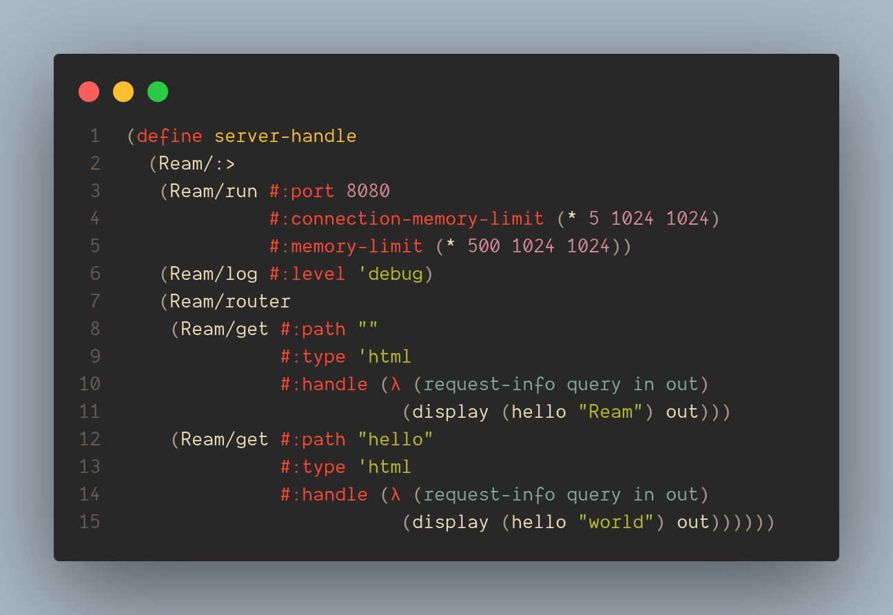

<div align="center">


low-level, and zero dependencies Racket web server

Ream

---

__This project is still under active development__



</div>

## Start
All middleware is defined in main.rkt with detailed comments, very simple, no need to say~

run test with `racket test.rkt`.

Then you can try to access the registered route, such as `127.0.0.1:8080` or `127.0.0.1:8080/hello`, or you can access the unregistered route, such as `127.0.0.1:8080/x`, view the output of the console:
```
$ racket test.rkt
| Tuesday, December 6th, 2022 8:53:19pm [DEBUG  ]       register a handle on hello with #<procedure:...space/ream/test.rkt:27:23>
| Tuesday, December 6th, 2022 8:53:19pm [DEBUG  ]       register a handle on  with #<procedure:...space/ream/test.rkt:23:23>
| Tuesday, December 6th, 2022 8:53:19pm [INFO   ]       starting server on port 8080
| Tuesday, December 6th, 2022 8:53:19pm [INFO   ]       server start complete
| Tuesday, December 6th, 2022 8:53:19pm [WARNING]       Press enter to exit server!
| Tuesday, December 6th, 2022 8:53:25pm [INFO   ]       request recevied -> (GET / HTTP/1.1 /)
| Tuesday, December 6th, 2022 8:53:31pm [INFO   ]       request recevied -> (GET /hello HTTP/1.1 /hello)
| Tuesday, December 6th, 2022 8:53:35pm [INFO   ]       request recevied -> (GET /x HTTP/1.1 /x)
| Tuesday, December 6th, 2022 8:53:35pm [ERROR  ]       No handler found! Router path -> /x
```

## License

MIT License

Copyright (c) 2022 Muqiu Han

Permission is hereby granted, free of charge, to any person obtaining a copy
of this software and associated documentation files (the "Software"), to deal
in the Software without restriction, including without limitation the rights
to use, copy, modify, merge, publish, distribute, sublicense, and/or sell
copies of the Software, and to permit persons to whom the Software is
furnished to do so, subject to the following conditions:

The above copyright notice and this permission notice shall be included in all
copies or substantial portions of the Software.

THE SOFTWARE IS PROVIDED "AS IS", WITHOUT WARRANTY OF ANY KIND, EXPRESS OR
IMPLIED, INCLUDING BUT NOT LIMITED TO THE WARRANTIES OF MERCHANTABILITY,
FITNESS FOR A PARTICULAR PURPOSE AND NONINFRINGEMENT. IN NO EVENT SHALL THE
AUTHORS OR COPYRIGHT HOLDERS BE LIABLE FOR ANY CLAIM, DAMAGES OR OTHER
LIABILITY, WHETHER IN AN ACTION OF CONTRACT, TORT OR OTHERWISE, ARISING FROM,
OUT OF OR IN CONNECTION WITH THE SOFTWARE OR THE USE OR OTHER DEALINGS IN THE
SOFTWARE.
